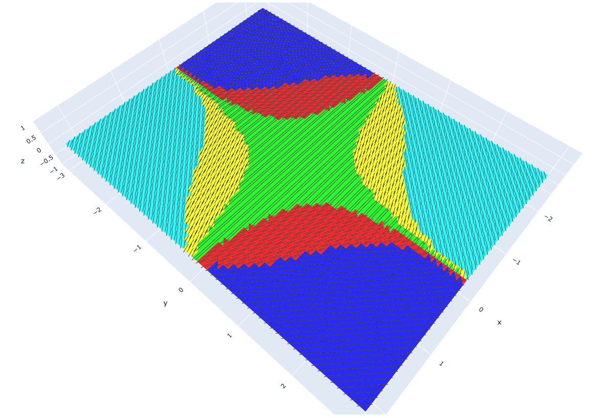

# Directional Clustering

[](https://www.travis-ci.com/arpastrana/directional_clustering)

Directional clustering of vector fields on meshes.



## Introduction

The initial motivation of this work revolved around principal stress fields.
In principle, they suggest good directions to orient material efficiently in
architectural structures. This implies that by following these directions,
less material would be used to achieve a target level of structural performance.

Principal stress fields are ubiquitously computed by off-the-shelf FEA software
and are represented as a cloud of vectors (i.e. a vector field).

As principal stress fields are heterogeneous and form continuous curvilinear
trajectories, it is actually difficult for fabrication reasons to place material
(in the form reinforcement bars or beams) in a way that exactly match the field
directions. It is almost cumbersome, and this is probably one of the reasons why
we actually keep on building with orthogonal grids everywhere (take a look at
the room around you, for example).

In this work we question the heterogeneity of a principal stress field and
inquiry on how much we can simplify it so that we can maximize fabricability
while compromising as little as possible in structural performance. In short,
what we want is to find the lowest possible amount of different vectors that
encode the maximum amount of directional information about a principal stress
field. We leverage clustering methods to this end.

## Installation

The simplest way to install `directional_clustering` is to build it from source
after cloning this repo. For developer mode, please jump to the developer section.

1. First, we would need to install the latest version of
[Anaconda](https://www.continuum.io/). Anaconda will take care, among many other
things, of installing scientific computing packages like `numpy` and
`matplotlib` for us.

2. Next, let's create a new `conda` environment from your command line interface
(your terminal on macOS or from the anaconda prompt on windows).
The only required dependencies are `compas` and`sklearn`.

```bash
conda create -n clusters python=3.7 COMPAS=0.16.9 scikit-learn
conda activate clusters
```

3. We should clone `directional_clustering` from this repository and move inside.
If you are a macOS user and want to put it in your home folder:

```bash
cd ~
git clone https://github.com/arpastrana/directional_clustering.git
cd directional_clustering
```

4. Next, install `directional_clustering` as an editable package from source using `pip`:

```bash
pip install -e .
```

5. To double-check that everything is up and running, still in your command line
interface, let's type the following and hit enter:

```bash
python -c "import directional_clustering"
```

If no errors occur, smile! You have a working installation of
`directional_clustering`.

## How to use this library?

After installation completed, we will be able to play around with this library
and do a bunch of cool tasks related to directional clustering! We provide two
examples scripts, `01_clustering.py` and `01_plotting.py`, which live under 
`directional_clustering/scripts`. If you are unsure of what arguments to pass in,
append the `--help` flag at the end to see what options are available.

First, `01_clustering.py` takes care of importing a mesh from a JSON file,
clustering on a vector field and exporting both the mesh the clustering results
into a new JSON file. Our script assumes that there is at least one vector field 
living on the mesh, stored as attributes on their faces. For further details on this,
please refer to the [COMPAS](https://compas.dev/) documentation on meshes. We have
provided amount of ready-made examples in the `data/json_files` folder. Feel free
to try them all out. Here, we will be using the `perimeter_supported_slab.json` 
by default.

Second, `01_plotting.py` takes care of simply displaying the clustering results 
from the JSON file we exported in with `01_clustering.py` on your browser.

Instructions on how to run these two are as follows.

1. Go to the scripts directory:

```bash
cd scripts
```

2. Run `01_clustering.py` from the command line. You can change specific arguments
by passing in the`--flag` syntax before their name. As usual, `--help` will prompt 
you with information of what arguments are expected and what is assumed by default.
Is a good idea to check this before running the script!

```
python 01_clustering.py --help
```

3. Next, the script will prompt you with the names of the vector field that currently
live on the mesh. The program require you to select only **one** of them onto wich
the clustering will be done. Such an scenario would look as follows. 

```bash
supported vector field attributes are:
 ['ps_2_top', 'ps_2_bot', 'ps_1_top', 'm_1', 'm_2', 'n_1', 'n_2', 'custom_2', 'ps_2_mid', 
 'ps_1_bot', 'ps_1_mid', 'custom_1']
please choose one attribute
```

4. After you type in the name of the vector field to cluster, we'd just need to 
wait for a few seconds till the process is over! The results will be stored in a
JSON file in the `data/json_files` folder. The filename is hard-coded as 
`mesh_filename`_`vectorfield_name`_`clustering_algo_name`_`n_clusters.json`.

5. To visualize the results of the clustering process, run `01_plotting.py`.
Don't forget to use the `--help` flag to see the documentation the available 
command line arguments.

```
python 01_plotting.py --help
```

6. A 3D plot should automatically open in your browser. Zoom in and orbit as you wish!

## Developer Mode

If you are rather interested in building the documentation, testing, or making a
pull request to this package, you should install this package slighly differently.

Concretely, instead of running `pip install -e .` in step 4 above, we must do:

```bash
pip install -r requirements-dev.txt
```

This will take care of installing additional dependencies like `sphinx` and `pytest`.

### Testing

To run the `pytest` suite automatically, type from the command line;

```bash
invoke test
```

### Documentation

To build this package's documentation in `html`, type:


```bash
invoke docs
```

You'll find the generated `html` data in the `docs/` folder.

If instead what we need is a manual in `pdf` format, let's run:


```bash
invoke pdf
```

The manual will be saved in `docs/latex` as `directional_clustering.pdf`.

## License

MIT
